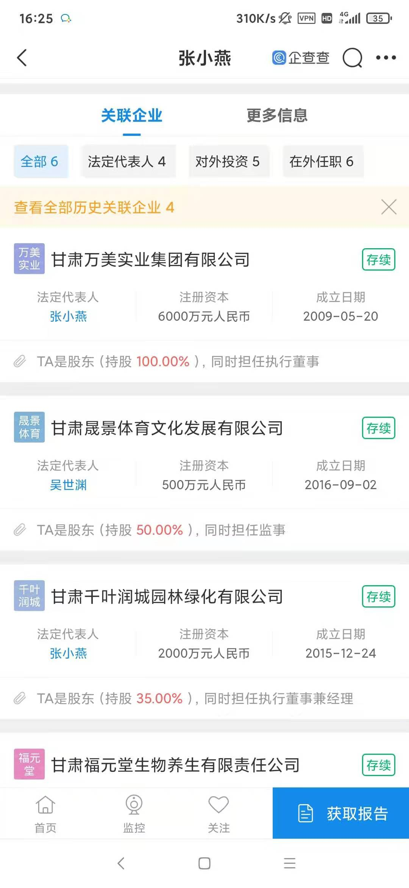

## 事件回顾

在中国，网络是没有记忆的，很多事件，火极一时，然后销声匿迹，谨以此仓库记录一些事件！

- [成都49中学生坠楼事件](https://baijiahao.baidu.com/s?id=1699352998439484224&wfr=spider&for=pc)
- [甘肃马拉松致死21人](https://www.sohu.com/subject/322927?_trans_=000014_bdss_dkmlssg)

甘肃马拉松事件涉事企业资料 跑马拉松死了会赔偿吗

该赛事由白银市委、市政府主办，景泰县承办，具体赛事运营由甘肃晟景体育文化发展有限公司负责。资料显示，甘肃晟景体育文化发展有限公司法人代表为吴世渊，公司注册金额500万元。公司两位股东分别为吴世渊和张小燕，两人皆持股50%。

由于出现死亡情况，法律专业人士认为，相关方可能要向死者家属提供赔偿，但具体情况如何，还有待官方公布。对于此事件，甘肃省白银市市长张旭晨称，作为赛事主办方，深感内疚和自责。

- [辽宁6岁虐童案](https://www.google.com/search?q=%E8%BE%BD%E5%AE%816%E5%B2%81%E8%99%90%E7%AB%A5%E6%A1%88+%E7%BB%93%E6%9E%9C&newwindow=1&sxsrf=ALeKk01bhH_tIcwQrqCInDCawPsIpuzZ0w%3A1624371446050&source=hp&ei=9fDRYM6WPJaE-gSOo4eABw&iflsig=AINFCbYAAAAAYNH_BgoqJxS8gMN0_Sa_XiI1lCdTrEiM&oq=%E8%BE%BD%E5%AE%816%E5%B2%81%E8%99%90%E7%AB%A5%E6%A1%88+%E7%BB%93%E6%9E%9C&gs_lcp=Cgdnd3Mtd2l6EAM6BwgjEOoCECdQtQtYtQtg6xJoAXAAeACAAYwGiAGMBpIBAzYtMZgBAKABAqABAaoBB2d3cy13aXqwAQo&sclient=gws-wiz&ved=0ahUKEwiO5ZWYt6vxAhUWgp4KHY7RAXAQ4dUDCAk&uact=5): 又是无头案，结果何年马月才能出来？

